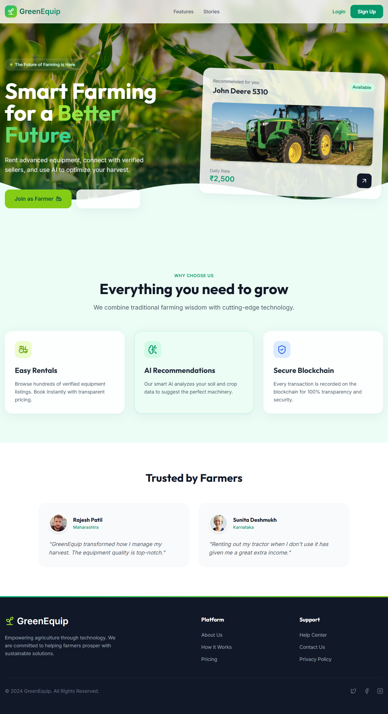
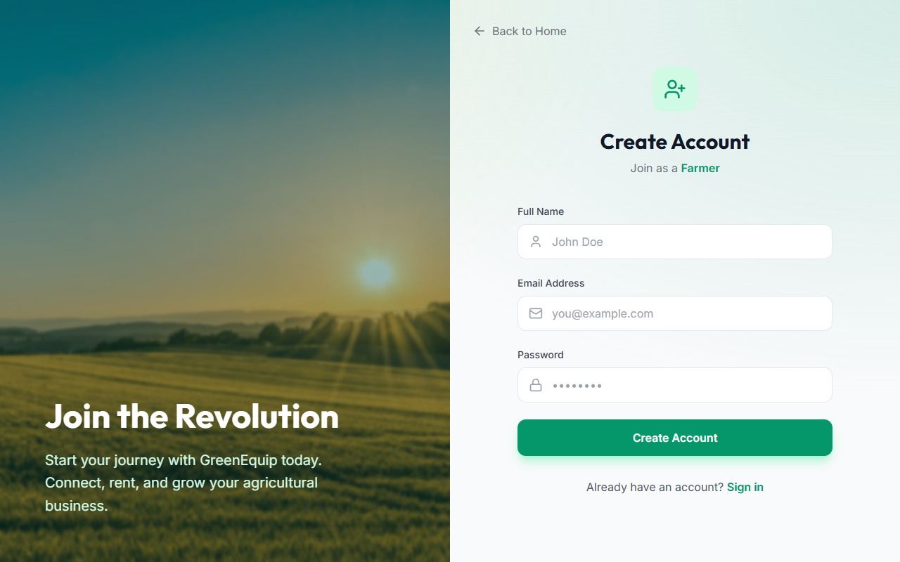
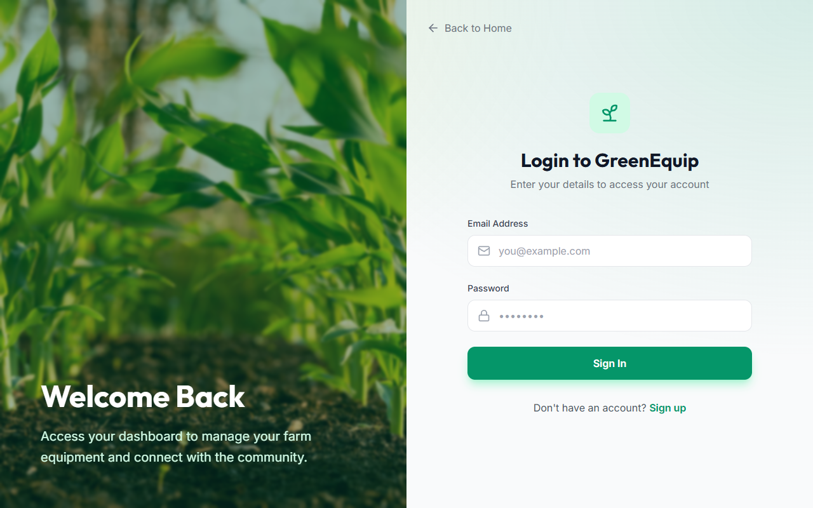

<div align="center">

  

  # GreenEquip 
  
  **Smart Farming for a Better Future**
  
  [](https://opensource.org/licenses/MIT)
  [](https://nodejs.org/)
  [](https://hardhat.org/)
  []()

  <p align="center">
    <b>Rent advanced equipment, connect with verified sellers, and use AI to optimize your harvest.</b>
    <br />
    A decentralized platform empowering farmers with secure blockchain transactions and AI-driven insights.
    <br />
    <br />
    <a href="#-features">Features</a> •
    <a href="#-tech-stack">Tech Stack</a> •
    <a href="#-getting-started">Getting Started</a> •
    <a href="#-screenshots">Screenshots</a>
  </p>
</div>

---

## 🌾 About The Project

**GreenEquip** is a revolutionary platform designed to bridge the gap between technology and agriculture. By leveraging **Blockchain** for secure, transparent transactions and **Artificial Intelligence** for personalized farming recommendations, we provide a comprehensive ecosystem for farmers to rent equipment and optimize their yields.

### Key Value Propositions
*   **Transparency**: All rental agreements and transactions are secured on the Ethereum blockchain.
*   **Efficiency**: AI algorithms analyze soil and crop data to recommend the best machinery.
*   **Accessibility**: A user-friendly interface connecting farmers with equipment owners seamlessly.

---

## ✨ Features

| Feature | Description |
| :--- | :--- |
| 🚜 **Easy Rentals** | Browse hundreds of verified equipment listings. Book instantly with transparent pricing. |
| 🧠 **AI Recommendations** | Smart AI analyzes your soil and crop data to suggest the perfect machinery for your needs. |
| 🛡️ **Secure Blockchain** | Every transaction is recorded on the blockchain for 100% transparency and security. |
| 📊 **Dashboards** | Dedicated dashboards for Farmers, Sellers, and Admins to manage bookings and listings. |
| 🔐 **Secure Auth** | Robust authentication system using JWT and secure cookies. |

---

## 🛠️ Tech Stack

This project is built using a modern full-stack architecture with Web3 integration.

### Frontend
*    **EJS**: Server-side rendering for dynamic views.
*    **TailwindCSS**: Utility-first CSS framework for styling.
*    **Modern CSS**: Glassmorphism and custom animations.

### Backend
*    **Node.js**: Runtime environment.
*    **Express.js**: Web framework.
*    **MongoDB**: NoSQL database for user and listing data.

### Blockchain & AI
*    **Hardhat**: Ethereum development environment.
*    **Python**: AI/ML models for pricing and recommendations.

---

## 📸 Screenshots

<div align="center">
  <!-- 
    PLACEHOLDER FOR SCREENSHOTS 
    Please save your screenshots in the 'screenshots' folder with these names.
  -->
  
  <br />
  <div style="display: flex; justify-content: center; gap: 20px;">
    
    
  </div>
</div>

---

## 🚀 Getting Started

Follow these steps to set up the project locally.

### Prerequisites
*   Node.js (v14 or higher)
*   MongoDB (Local or Atlas)
*   Python (for AI modules)

### Installation

1.  **Clone the repository**
    ```bash
    git clone https://github.com/yourusername/Farmchain.git
    cd Farmchain
    ```

2.  **Install dependencies**
    ```bash
    # Install Node.js dependencies
    npm install
    
    # Install Python dependencies (if applicable)
    pip install -r requirements.txt
    ```

3.  **Configure Environment**
    *   Create a `.env` file in the root directory.
    *   Add your MongoDB URI and JWT Secret.

4.  **Run the Application**
    ```bash
    npm run dev
    ```
    The server will start at `http://localhost:3000`.

---

## 🤝 Contributing

Contributions are what make the open source community such an amazing place to learn, inspire, and create. Any contributions you make are **greatly appreciated**.

1.  Fork the Project
2.  Create your Feature Branch (`git checkout -b feature/AmazingFeature`)
3.  Commit your Changes (`git commit -m 'Add some AmazingFeature'`)
4.  Push to the Branch (`git push origin feature/AmazingFeature`)
5.  Open a Pull Request

---

<div align="center">
  <p>Made with ❤️ by the GreenEquip Team</p>
</div>
